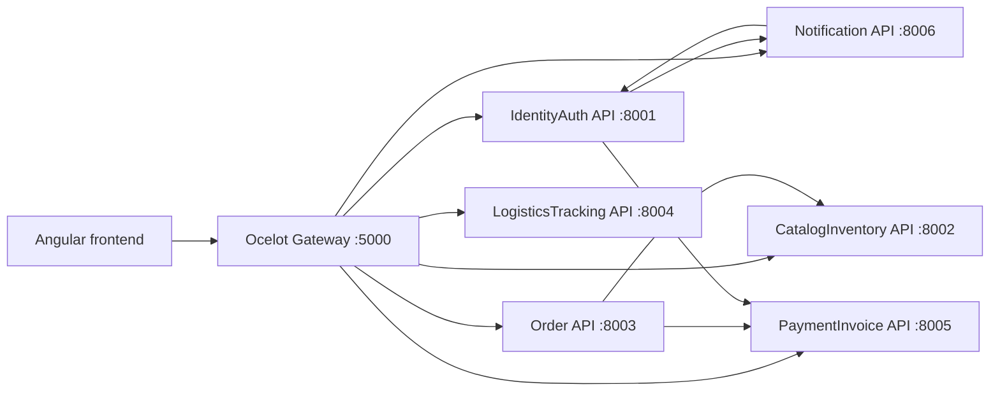

# Mapa Systemu

## Widok wysokiego poziomu

Status: `potwierdzone` na podstawie `SupplyChainPlatform.slnx`, `supply-chain-frontend/package.json`, `gateway/OcelotGateway/ocelot.json` i `services/**/Properties/launchSettings.json`.

## Moduły runtime

| Moduł | Port lokalny | Źródło | Status |
|---|---:|---|---|
| OcelotGateway | 5000 | `gateway/OcelotGateway/Properties/launchSettings.json` | potwierdzone |
| IdentityAuth.API | 8001 | `services/IdentityAuth/IdentityAuth.API/Properties/launchSettings.json` | potwierdzone |
| CatalogInventory.API | 8002 | `services/CatalogInventory/CatalogInventory.API/Properties/launchSettings.json` | potwierdzone |
| Order.API | 8003 | `services/Order/Order.API/Properties/launchSettings.json` | potwierdzone |
| LogisticsTracking.API | 8004 | `services/LogisticsTracking/LogisticsTracking.API/Properties/launchSettings.json` | potwierdzone |
| PaymentInvoice.API | 8005 | `services/PaymentInvoice/PaymentInvoice.API/Properties/launchSettings.json` | potwierdzone |
| Notification.API | 8006 | `services/Notification/Notification.API/Properties/launchSettings.json` | potwierdzone |

