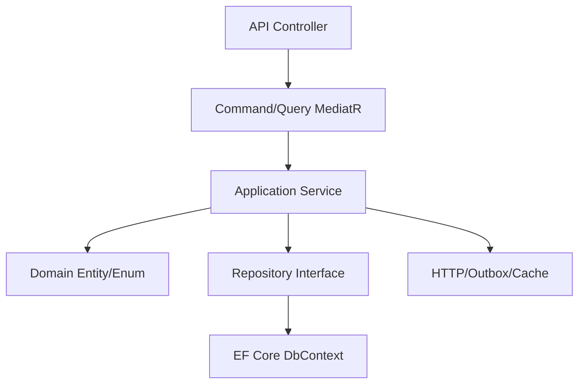

# Architektura

## Styl architektoniczny

Status: `potwierdzone` na podstawie układu projektów w `SupplyChainPlatform.slnx`.

Aplikacja jest lokalnym POC opartym o frontend Angular, Ocelot Gateway i mikroserwisy .NET. Serwisy backendowe stosują powtarzalny podział:

- `*.API` - kontrolery, autoryzacja, middleware, Swagger, Hangfire i start aplikacji.
- `*.Application` - DTO, komendy, zapytania, walidatory FluentValidation i usługi aplikacyjne.
- `*.Domain` - encje, enumy i reguły domenowe.
- `*.Infrastructure` - EF Core, repozytoria, cache Redis, outbox, integracje HTTP, RabbitMQ.

## Cross-cutting

| Mechanizm | Źródła | Status |
|---|---|---|
| JWT Bearer | `Program.cs` w gateway i API | potwierdzone |
| Role w kontrolerach | atrybuty `[Authorize(Roles = "...")]` | potwierdzone |
| MediatR | projekty `Application`, kontrolery wysyłające komendy/zapytania przez `ISender` | potwierdzone |
| FluentValidation | `services/**/Application/Validation/**` | potwierdzone |
| EF Core | `services/**/Infrastructure/Persistence/*DbContext.cs` | potwierdzone |
| Hangfire | `Program.cs`, projekty `API` | potwierdzone |
| Redis | connection string `Redis`, klasy cache/token revocation | potwierdzone |
| RabbitMQ/outbox | `OutboxMessages`, dispatchery tła | potwierdzone |

## Główne zależności warstw

