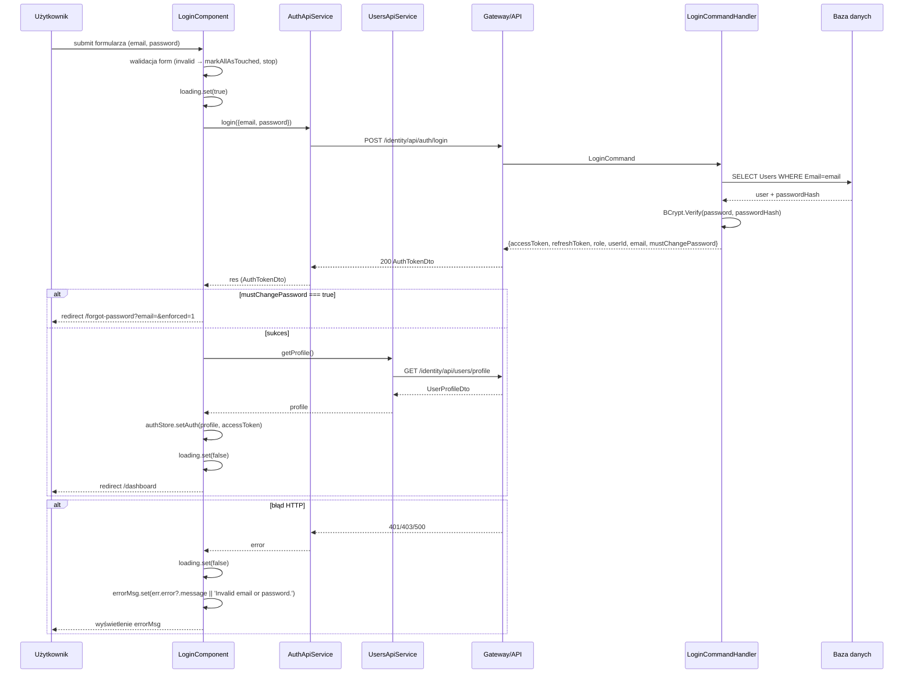

# A-001-0001 submit

Status: `wniosek z analizy`; wymagane ręczne uzupełnienie po analizie UI, API i procesu.

## Identyfikacja

| Atrybut | Wartość |
|---|---|
| ID akcji | `A-001-0001` |
| Ekran | [E-001](../E-001__README.md) |
| Nazwa wykryta | `submit` |
| Typ detekcji | `ngSubmit` |
| Źródło | `supply-chain-frontend/src/app/features/auth/login/login.component.html` |
| Status faktu | `do uzupełnienia` |

## Opis Akcji

**Co robi:** wywołuje `AuthApiService.login({email, password})` → `POST /identity/api/auth/login`. Po sukcesie pobiera profil przez `UsersApiService.getProfile()` → `GET /identity/api/users/profile`, zapisuje dane w `AuthStore` i przekierowuje na `/dashboard`. Jeśli `res.mustChangePassword === true` — przekierowuje na `/forgot-password?email=&enforced=1`. **Wyzwalacz:** submit formularza (`ngSubmit` na `<form>`). **Warunki dostępności:** formularz musi być valid (`form.invalid` blokuje wykonanie i oznacza wszystkie pola jako touched). **Skutki uboczne:** zapis `accessToken` do `AuthStore` (pamięć) + profil użytkownika; redirect na `/dashboard`.

## Diagram Przepływu

## Ślad Techniczny

| Warstwa | Artefakt | Status |
|---|---|---|
| Element UI | `<form (ngSubmit)="submit()">` + przycisk submit | `wniosek z analizy` |
| Metoda komponentu | `LoginComponent.submit()` | `potwierdzone` |
| Serwis frontend (login) | `AuthApiService.login({email, password})` | `potwierdzone` |
| Serwis frontend (profil) | `UsersApiService.getProfile()` | `potwierdzone` |
| Endpoint login | `POST /identity/api/auth/login` | `potwierdzone` |
| Endpoint profil | `GET /identity/api/users/profile` | `potwierdzone` |
| Komenda/zapytanie | `LoginCommand` → `LoginCommandHandler` | `wniosek z analizy` |
| Walidacje | `form.invalid` → stop; formularz `Validators.required + Validators.email` | `potwierdzone` |
| Skutek w bazie | brak zapisu — tylko odczyt Users; refreshToken opcjonalnie w RefreshTokens | `wniosek z analizy` |

## Testy

- [Macierz testów ekranu](../TC-001_TESTY/TC-001__INDEX.md)
- Dane wejściowe: do uzupełnienia.
- Oczekiwany rezultat: do uzupełnienia.

## Linki

- [Indeks akcji](A-001__INDEX.md)
- [Pola ekranu](../P-001_POLA/P-001__INDEX.md)
- [Ślad ekranu](../E-001__LINKI.md)
