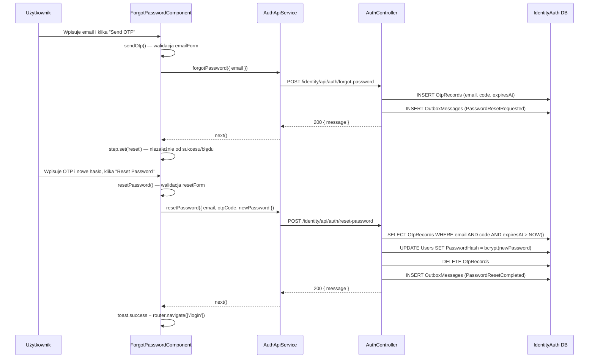

# A-003-0004 submit

Status: `szkielet`; wymagane ręczne uzupełnienie po analizie UI, API i procesu.

## Identyfikacja

| Atrybut | Wartość |
|---|---|
| ID akcji | `A-003-0004` |
| Ekran | [E-003](../E-003__README.md) |
| Nazwa wykryta | `submit` |
| Typ detekcji | `submit-button` |
| Źródło | `supply-chain-frontend/src/app/features/auth/forgot-password/forgot-password.component.html` |
| Status faktu | `wniosek z analizy` |

## Opis Akcji

Akcja "Wyślij OTP" — submit formularza kroku `email`. Użytkownik klika przycisk "Send OTP" (lub "Continue"). Komponent wywołuje `sendOtp()`, który waliduje formularz i wysyła `POST /identity/api/auth/forgot-password` z emailem. Niezależnie od sukcesu lub błędu HTTP komponent przechodzi do kroku `reset` (step = 'reset') aby zawsze pokazać formularz OTP — to jest celowe (security through obscurity: nie ujawniamy czy email istnieje). Dla drugiego etapu (reset hasła) analogiczna akcja to `resetPassword()` wywoływana przez submit drugiego formularza.

## Ślad Techniczny

| Warstwa | Artefakt | Status |
|---|---|---|
| Element UI (krok 1) | Przycisk submit w `emailForm` | `wniosek z analizy` |
| Element UI (krok 2) | Przycisk submit w `resetForm` | `wniosek z analizy` |
| Metoda komponentu (krok 1) | `sendOtp()` w `forgot-password.component.ts` | `wniosek z analizy` |
| Metoda komponentu (krok 2) | `resetPassword()` w `forgot-password.component.ts` | `wniosek z analizy` |
| Serwis frontend | `AuthApiService.forgotPassword()` / `AuthApiService.resetPassword()` | `wniosek z analizy` |
| Endpoint API (krok 1) | `POST /identity/api/auth/forgot-password` | `wniosek z analizy` |
| Endpoint API (krok 2) | `POST /identity/api/auth/reset-password` | `wniosek z analizy` |
| Komenda backend | `ForgotPasswordCommand` / `ResetPasswordCommand` (IdentityAuth.Application) | `wniosek z analizy` |
| Walidacje frontend | `emailForm`: `Validators.required`, `Validators.email`; `resetForm`: `otpCode` pattern `^\d{6}$`, `newPassword` minLength 8 | `wniosek z analizy` |
| Walidacje backend | `ResetPasswordRequestValidator`: email format, OTP 6 cyfr, hasło minLength 8 + uppercase + cyfra | `wniosek z analizy` |
| Skutek w bazie (krok 1) | Zapis `OtpRecords` z kodem OTP i TTL; outbox `PasswordResetRequested` | `wniosek z analizy` |
| Skutek w bazie (krok 2) | Update `Users.PasswordHash`; usunięcie `OtpRecords`; outbox `PasswordResetCompleted` | `wniosek z analizy` |

## Diagram Przepływu



## Przykład Żądania HTTP

Krok 1 — wysłanie OTP:
```http
POST /identity/api/auth/forgot-password
Content-Type: application/json

{
  "email": "dealer@example.com"
}
```

Krok 2 — reset hasła:
```http
POST /identity/api/auth/reset-password
Content-Type: application/json

{
  "email": "dealer@example.com",
  "otpCode": "123456",
  "newPassword": "NewPass1!"
}
```

## Testy

- [Macierz testów ekranu](../TC-003_TESTY/TC-003__INDEX.md)
- Dane wejściowe: do uzupełnienia.
- Oczekiwany rezultat: do uzupełnienia.

## Linki

- [Indeks akcji](A-003__INDEX.md)
- [Pola ekranu](../P-003_POLA/P-003__INDEX.md)
- [Ślad ekranu](../E-003__LINKI.md)
