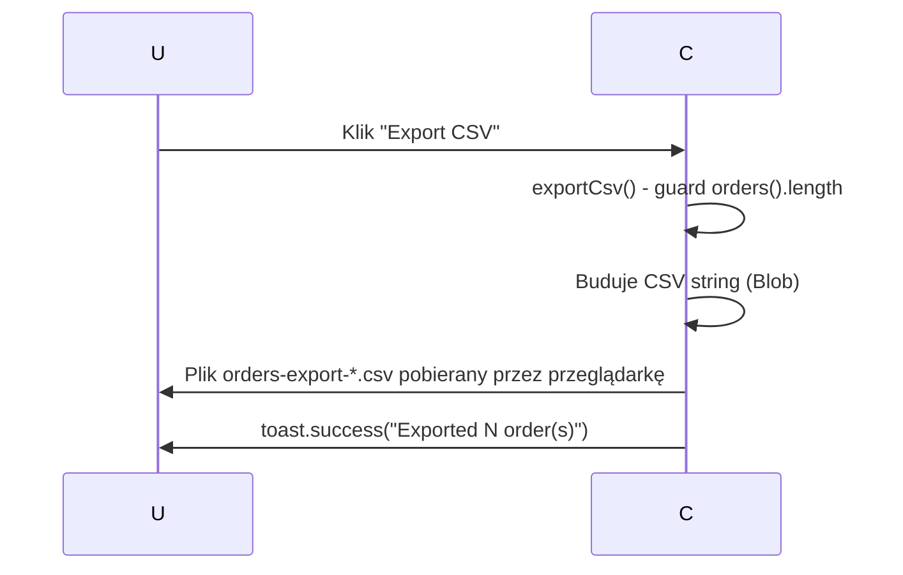

# A-013-0001 exportCsv

Status: `wniosek z analizy`; uzupełnione na podstawie analizy komponentu Angular.

## Identyfikacja

| Atrybut | Wartość |
|---|---|
| ID akcji | `A-013-0001` |
| Ekran | [E-013](../E-013__README.md) |
| Nazwa wykryta | `exportCsv` |
| Typ detekcji | `click` |
| Źródło | `supply-chain-frontend/src/app/features/orders/order-list/order-list.component.html` |
| Status faktu | `wniosek z analizy` |

## Opis Akcji

Eksport aktualnie widocznej listy zamówień do pliku CSV. Metoda `exportCsv()` buduje CSV w pamięci z nagłówkami `Order Number, Order Id, Dealer Id, Status, Total Amount, Placed At UTC`, tworzy `Blob` i inicjuje pobranie pliku przez `<a>` element. Brak wywołania API — dane pobrane są z lokalnego sygnału `orders()`.

## Ślad Techniczny

| Warstwa | Artefakt | Status |
|---|---|---|
| Element UI | Przycisk "Export CSV" | `wniosek z analizy` |
| Metoda komponentu | `OrderListComponent.exportCsv()` | `potwierdzone` |
| Serwis frontend | Brak — operacja czysto kliencka | `potwierdzone` |
| Endpoint API | Brak wywołania | `potwierdzone` |
| Komenda/zapytanie | Brak | `potwierdzone` |
| Walidacje | Guard: `orders().length === 0` → wcześniejszy return | `potwierdzone` |
| Skutek w bazie | Brak | `potwierdzone` |

## Diagram Przepływu

## Testy

- [Macierz testów ekranu](../TC-013_TESTY/TC-013__INDEX.md)
- Dane wejściowe: do uzupełnienia.
- Oczekiwany rezultat: do uzupełnienia.

## Linki

- [Indeks akcji](A-013__INDEX.md)
- [Pola ekranu](../P-013_POLA/P-013__INDEX.md)
- [Ślad ekranu](../E-013__LINKI.md)
