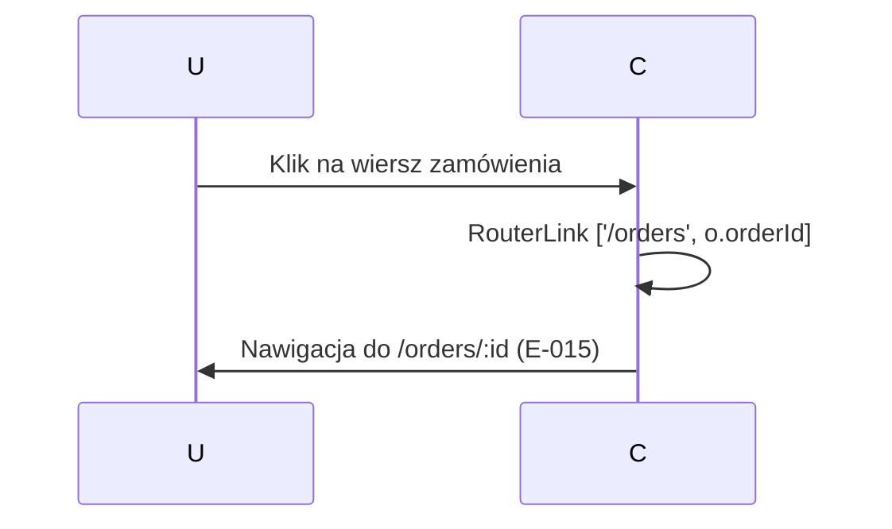

# A-013-0009 navigate [

Status: `wniosek z analizy`; uzupełnione na podstawie analizy komponentu Angular.

## Identyfikacja

| Atrybut | Wartość |
|---|---|
| ID akcji | `A-013-0009` |
| Ekran | [E-013](../E-013__README.md) |
| Nazwa wykryta | `navigate [` |
| Typ detekcji | `bound-routerLink` |
| Źródło | `supply-chain-frontend/src/app/features/orders/order-list/order-list.component.html` |
| Status faktu | `wniosek z analizy` |

## Opis Akcji

Kliknięcie w wiersz zamówienia (routerLink) nawiguje do ekranu szczegółu zamówienia `/orders/:id`. Akcja czysto nawigacyjna — brak wywołania API w chwili kliknięcia. Ekran docelowy (E-015) samodzielnie ładuje dane zamówienia.

## Ślad Techniczny

| Warstwa | Artefakt | Status |
|---|---|---|
| Element UI | Wiersz tabeli `<tr>` lub link w kolumnie `orderNumber` | `wniosek z analizy` |
| Metoda komponentu | Brak — Angular `[routerLink]="['/orders', o.orderId]"` | `wniosek z analizy` |
| Serwis frontend | `RouterLink` (Angular) | `potwierdzone` |
| Endpoint API | Brak wywołania w tej akcji | `potwierdzone` |
| Komenda/zapytanie | Brak | `potwierdzone` |
| Walidacje | Brak | `potwierdzone` |
| Skutek w bazie | Brak | `potwierdzone` |

## Diagram Przepływu

## Testy

- [Macierz testów ekranu](../TC-013_TESTY/TC-013__INDEX.md)
- Dane wejściowe: do uzupełnienia.
- Oczekiwany rezultat: do uzupełnienia.

## Linki

- [Indeks akcji](A-013__INDEX.md)
- [Pola ekranu](../P-013_POLA/P-013__INDEX.md)
- [Ślad ekranu](../E-013__LINKI.md)
