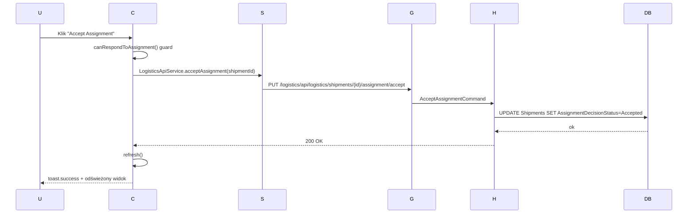

# A-014-0002 acceptAssignment

Status: `wniosek z analizy`; uzupełnione na podstawie analizy komponentu Angular.

## Identyfikacja

| Atrybut | Wartość |
|---|---|
| ID akcji | `A-014-0002` |
| Ekran | [E-014](../E-014__README.md) |
| Nazwa wykryta | `acceptAssignment` |
| Typ detekcji | `click` |
| Źródło | `supply-chain-frontend/src/app/features/orders/order-tracking/order-tracking.component.html` |
| Status faktu | `wniosek z analizy` |

## Opis Akcji

Agent akceptuje przypisanie do shipmentu. Warunek: rola Agent, shipment przypisany do zalogowanego agenta, decyzja `Pending`, status nie `Delivered/Returned`. Po akceptacji `AssignmentDecisionStatus` zmienia się na `Accepted` i ekran jest odświeżany.

## Ślad Techniczny

| Warstwa | Artefakt | Status |
|---|---|---|
| Element UI | Przycisk "Accept Assignment" | `wniosek z analizy` |
| Metoda komponentu | `OrderTrackingComponent.acceptAssignment()` | `potwierdzone` |
| Serwis frontend | `LogisticsApiService.acceptAssignment(shipmentId)` | `potwierdzone` |
| Endpoint API | `PUT /logistics/api/logistics/shipments/{id}/assignment/accept` | `potwierdzone` |
| Komenda/zapytanie | Body: `{}` (puste) | `potwierdzone` |
| Walidacje | `canRespondToAssignment()`: isAgent, assigned to user, Pending, not Delivered/Returned | `potwierdzone` |
| Skutek w bazie | `Shipments.AssignmentDecisionStatus = Accepted`, `AssignmentDecisionAtUtc` | `wniosek z analizy` |

## Diagram Przepływu

## Testy

- [Macierz testów ekranu](../TC-014_TESTY/TC-014__INDEX.md)
- Dane wejściowe: do uzupełnienia.
- Oczekiwany rezultat: do uzupełnienia.

## Linki

- [Indeks akcji](A-014__INDEX.md)
- [Pola ekranu](../P-014_POLA/P-014__INDEX.md)
- [Ślad ekranu](../E-014__LINKI.md)
