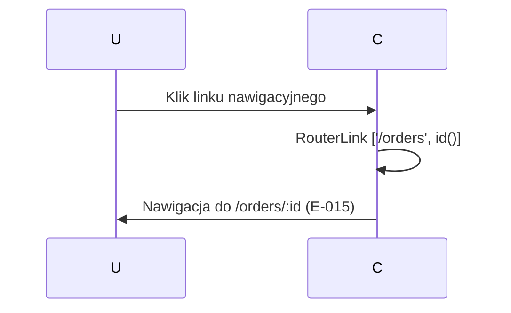

# A-014-0007 navigate [

Status: `wniosek z analizy`; uzupełnione na podstawie analizy komponentu Angular.

## Identyfikacja

| Atrybut | Wartość |
|---|---|
| ID akcji | `A-014-0007` |
| Ekran | [E-014](../E-014__README.md) |
| Nazwa wykryta | `navigate [` |
| Typ detekcji | `bound-routerLink` |
| Źródło | `supply-chain-frontend/src/app/features/orders/order-tracking/order-tracking.component.html` |
| Status faktu | `wniosek z analizy` |

## Opis Akcji

Nawigacja wsteczna do szczegółu zamówienia `/orders/:id`. Czysto nawigacyjna akcja routerLink — brak API call. Widoczna dla wszystkich ról na tym ekranie.

## Ślad Techniczny

| Warstwa | Artefakt | Status |
|---|---|---|
| Element UI | Link "Back to Order" lub podobny | `wniosek z analizy` |
| Metoda komponentu | Brak — `[routerLink]="['/orders', id()]"` | `wniosek z analizy` |
| Serwis frontend | `RouterLink` (Angular) | `potwierdzone` |
| Endpoint API | Brak | `potwierdzone` |
| Komenda/zapytanie | Brak | `potwierdzone` |
| Walidacje | Brak | `potwierdzone` |
| Skutek w bazie | Brak | `potwierdzone` |

## Diagram Przepływu

## Testy

- [Macierz testów ekranu](../TC-014_TESTY/TC-014__INDEX.md)
- Dane wejściowe: do uzupełnienia.
- Oczekiwany rezultat: do uzupełnienia.

## Linki

- [Indeks akcji](A-014__INDEX.md)
- [Pola ekranu](../P-014_POLA/P-014__INDEX.md)
- [Ślad ekranu](../E-014__LINKI.md)
