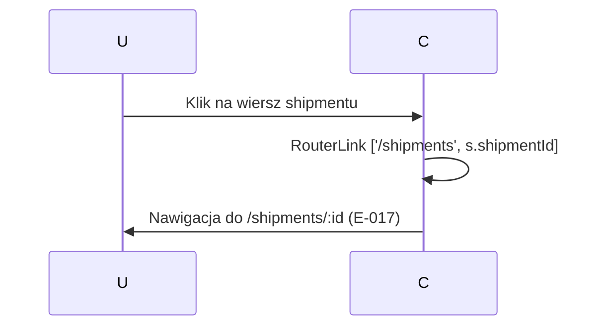

# A-016 Akcje UI

Status: `wniosek z analizy`; uzupełnione na podstawie analizy komponentu Angular.

Automatyczna detekcja nie wykryła plików atomowych akcji. Poniżej zestawienie akcji zidentyfikowanych ręcznie z kodu komponentu:

| ID akcji | Nazwa | Typ | Opis |
|---|---|---|---|
| (do utworzenia) | `applyFilter` | `(ngModelChange)` / `change` | Zmiana `statusFilter`, `slaFilter` lub `opsFilter` wywołuje `applyFilter()` — kliencki filtr na załadowanej liście. Brak API call. |
| (do utworzenia) | nawigacja do szczegółu | `routerLink` | Klik w wiersz lub numer shipmentu — nawigacja do `/shipments/:id` (E-017). Brak API call. |

## Akcje Zidentyfikowane z Kodu

### applyFilter (filtrowanie listy)

**Opis:** Zmiana wartości dowolnego z filtrów (`statusFilter`, `slaFilter`, `opsFilter`) wywołuje `applyFilter()`. Metoda filtruje lokalny array `all()` i aktualizuje `filtered()`. Brak wywołania API — wszystkie dane są już załadowane.

**Metoda komponentu:** `ShipmentListComponent.applyFilter()`  
**Endpoint API:** Brak  
**Skutek w bazie:** Brak

### navigate — nawigacja do szczegółu shipmentu

**Opis:** Klik w wiersz tabeli lub link numeru shipmentu nawiguje do `/shipments/:id`. Akcja czysto nawigacyjna (routerLink).

**Diagram przepływu:**

## Reguła Uzupełniania

Każda akcja musi docelowo wskazywać element UI, metodę komponentu, serwis frontend, endpoint API, walidacje, skutek biznesowy, skutek w bazie i przypadki testowe.
