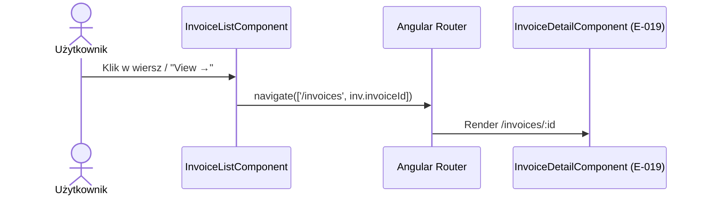

# A-018-0013 navigate [

Status: `wniosek z analizy`

## Identyfikacja

| Atrybut | Wartość |
|---|---|
| ID akcji | `A-018-0013` |
| Ekran | [E-018](../E-018__README.md) |
| Nazwa wykryta | `navigate [` |
| Typ detekcji | `bound-routerLink` |
| Źródło | `supply-chain-frontend/src/app/features/payments/invoice-list/invoice-list.component.html` |
| Status faktu | `wniosek z analizy` |

## Opis Akcji

Nawigacja do szczegółu faktury. Kliknięcie w wiersz tabeli (`[routerLink]="['/invoices', inv.invoiceId]"`) lub w przycisk "View →" w kolumnie akcji przenosi użytkownika do ekranu [E-019_INVOICES_ID](/invoices/:id).

## Ślad Techniczny

| Warstwa | Artefakt | Status |
|---|---|---|
| Element UI | `<tr [routerLink]="['/invoices', inv.invoiceId]">` i `<a [routerLink]="['/invoices', inv.invoiceId]" class="btn btn-ghost btn-sm">View →</a>` | `wniosek z analizy` |
| Metoda komponentu | brak (routerLink deklaratywny) | `wniosek z analizy` |
| Serwis frontend | Angular Router | `wniosek z analizy` |
| Endpoint API | brak — nawigacja kliencka | `brak w kodzie` |
| Komenda/zapytanie | brak | `brak w kodzie` |
| Walidacje | brak | `brak w kodzie` |
| Skutek w bazie | brak | `brak w kodzie` |

## Diagram Przepływu

## Testy

- [Macierz testów ekranu](../TC-018_TESTY/TC-018__INDEX.md)
- Dane wejściowe: `inv.invoiceId` (GUID).
- Oczekiwany rezultat: URL zmienia się na `/invoices/{invoiceId}`, renderowany jest E-019.

## Linki

- [Indeks akcji](A-018__INDEX.md)
- [Pola ekranu](../P-018_POLA/P-018__INDEX.md)
- [Ślad ekranu](../E-018__LINKI.md)
