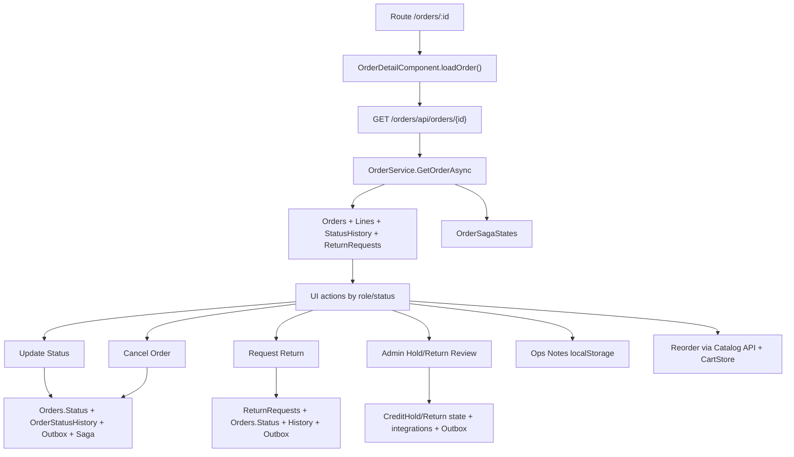

# Proces End-To-End: Szczegół I Lifecycle Zamówienia

Status: `potwierdzone` na podstawie route'u, komponentu Angular, kontrolerów, serwisu aplikacyjnego, domeny i DbContext.
Powiązany AOS: `AI_Documentation/05_UI_AOS/AOS_ORDER_DETAIL.md`.

## Zakres

Proces obejmuje wejście na `/orders/:id`, odczyt szczegółu zamówienia oraz akcje: zmiana statusu, anulowanie, request return, approve/reject hold, approve/reject return, notatki operacyjne i reorder.

## Diagram

## Odczyt Szczegółu

| Krok | Warstwa | Działanie | Dane | Status |
|---:|---|---|---|---|
| 1 | Angular router | `roleGuard` dopuszcza `Admin`, `Dealer`, `Warehouse`, `Logistics` | JWT role | potwierdzone |
| 2 | Component | `ngOnInit()` wywołuje `loadOrder()` | `id()` route param | potwierdzone |
| 3 | Angular API | `OrderApiService.getOrderById` robi `GET /orders/api/orders/{id}` | `OrderDto` | potwierdzone |
| 4 | Controller | `OrdersController.GetById` pobiera `userId` i rolę z tokenu | `sub` lub `NameIdentifier`, `ClaimTypes.Role` | potwierdzone |
| 5 | Application | `GetOrderAsync` ładuje order i sprawdza data scope | Dealer tylko własny; Admin/Warehouse/Logistics wszystkie | potwierdzone |
| 6 | Repository | `GetOrderByIdAsync` includuje `Lines`, `StatusHistory`, `ReturnRequest` | `Orders`, `OrderLines`, `OrderStatusHistory`, `ReturnRequests` | potwierdzone |
| 7 | Saga | `sagaCoordinator.GetAsync` dołącza stan sagi | `OrderSagaStates` | potwierdzone backend; UI TS nie modeluje `saga` |
| 8 | UI | template renderuje summary, lines, history, return, ops notes | DTO i localStorage | potwierdzone |

## Zmiana Statusu

| Krok | Warstwa | Działanie | Efekt danych | Status |
|---:|---|---|---|---|
| 1 | UI | `canUpdateStatus()` wymaga roli lifecycle i `nextStatuses().length > 0` | brak zapisu | potwierdzone |
| 2 | UI | `nextStatuses()` bierze kandydatów z `ORDER_STATUS_TRANSITIONS` i filtruje target per rola | `Admin` wszystkie; `Logistics` wybrane; `Warehouse` tylko `ReadyForDispatch` | potwierdzone |
| 3 | API | `PUT /orders/api/orders/{id}/status` wysyła `UpdateOrderStatusRequest.NewStatus` | request DTO | potwierdzone |
| 4 | Controller | `CanManageOrderStatus` dopuszcza tylko `Admin`, `Logistics` | `Warehouse` dostaje `Forbid()` | konflikt potwierdzony |
| 5 | Service | `CanRoleManageOrderStatus` dopuszcza `Warehouse` dla `ReadyForDispatch`, ale ta rola nie przechodzi kontrolera | brak efektu dla Warehouse | konflikt potwierdzony |
| 6 | Domain | `CanTransitionTo` sprawdza dozwolone przejście | `Orders.Status` | potwierdzone |
| 7 | Integracje | dla `ReadyForDispatch -> InTransit` hard deduct; dla `Cancelled` release soft locks | CatalogInventory | potwierdzone |
| 8 | Persistence | `TransitionTo` zapisuje status i historię, potem outbox i saga | `Orders`, `OrderStatusHistory`, `OutboxMessages`, `OrderSagaStates` | potwierdzone |

## Anulowanie

| Krok | Warstwa | Działanie | Efekt danych | Status |
|---:|---|---|---|---|
| 1 | UI | `canCancel`: Dealer tylko `Placed/OnHold`, Admin jeśli status nie `Cancelled/Closed` | brak zapisu | potwierdzone |
| 2 | API | `POST /orders/api/orders/{id}/cancel` z `CancelOrderRequest.Reason` | reason max 400 | potwierdzone |
| 3 | Controller | `[Authorize(Roles = "Dealer,Admin")]` | auth role | potwierdzone |
| 4 | Service | `CancelOrderAsync` pobiera order po ID i nie sprawdza `DealerId` dla roli Dealer | luka data scope | potwierdzone |
| 5 | Domain | `Cancel` ustawia `CancellationReason` i `Status=Cancelled` przez `TransitionTo` | `Orders`, `OrderStatusHistory` | potwierdzone |
| 6 | Persistence | zapis `OrderCancelled`, save, saga completed cancelled | `OutboxMessages`, `OrderSagaStates` | potwierdzone |

## Zwrot

| Krok | Warstwa | Działanie | Efekt danych | Status |
|---:|---|---|---|---|
| 1 | UI | `canReturn`: Dealer, status `Delivered`, brak `returnRequest`, okno 48h nie wygasło | brak zapisu | potwierdzone |
| 2 | API | `POST /orders/api/orders/{id}/returns` z `ReturnRequestDto.Reason` | reason max 500 | potwierdzone |
| 3 | Service | `RequestReturnAsync` wymaga `order.DealerId == dealerId` | data scope | potwierdzone |
| 4 | Domain | `RaiseReturn` wymaga `Delivered`, liczy 48h od ostatniego `Delivered` w historii albo `PlacedAtUtc`, blokuje drugi return | reguły domenowe | potwierdzone |
| 5 | Persistence | tworzy `ReturnRequests`, przejście `ReturnRequested`, outbox `ReturnRequested` | `ReturnRequests`, `Orders`, `OrderStatusHistory`, `OutboxMessages` | potwierdzone |
| 6 | Admin approve | `ApproveReturnAsync` restockuje stock, rozlicza outstanding, ustawia `ReturnApproved`, outbox | CatalogInventory, PaymentInvoice, Order DB | potwierdzone |
| 7 | Admin reject | `RejectReturnAsync` waliduje reason, ustawia `ReturnRejected`, outbox | Order DB | potwierdzone |

## Credit Hold

| Akcja | Warunek | Efekt | Status |
|---|---|---|---|
| Approve Hold | UI i API tylko Admin, status `OnHold` | `CreditHoldStatus=Approved`, `Status=Processing`, `OrderApproved`, saga completed approved | potwierdzone |
| Reject Hold | UI i API tylko Admin, status `OnHold` | `CreditHoldStatus=Rejected`, `Status=Cancelled`, `CancellationReason`, `OrderCancelled`, saga completed rejected | potwierdzone |
| Audyt actor przy reject hold | `MarkCreditRejected` woła `Cancel(reason, Guid.Empty, "System")` | historia statusu może mieć `System`, nie admina | potwierdzone jako ryzyko |

## Notatki Operacyjne I Reorder

| Funkcja | Przepływ | DB | Status |
|---|---|---|---|
| Operations Notes & Tags | `OrderOpsNotesService.add/list/remove` | brak; `localStorage` `scp.order-ops-notes.v1` | potwierdzone |
| Reorder Items | dla każdej linii `CatalogApiService.getProductById`, potem `CartStore.addItem` z normalizacją ilości | brak zapisu DB w tej akcji | potwierdzone |

## Krytyczne Ryzyka Procesu

| Priorytet | Ryzyko | Warunek zamknięcia |
|---|---|---|
| P0 | Dealer cancel bez sprawdzenia właściciela orderu. | Test API i decyzja implementacyjna: dodać owner check albo jawnie uzasadnić regułę. |
| P0 | `Warehouse` update status niespójny między UI, kontrolerem i serwisem. | Jedna spójna reguła w UI/backend oraz test. |
| P1 | Local ops notes bez backendu. | Decyzja produktowa: local-only albo endpoint/tabela audytu. |
| P1 | `OrderDto.Saga` nieobecne w TS modelu. | TS model i UI albo dokumentowana rezygnacja z pokazywania sagi. |
