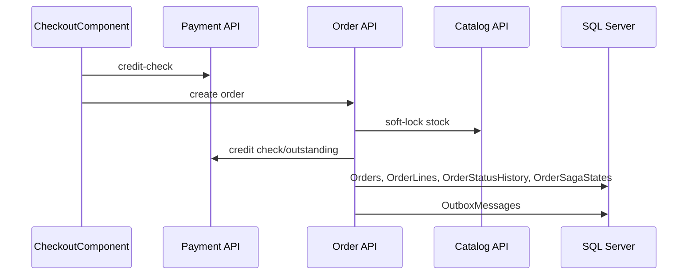

# Procesy End-To-End

## Lista procesów

| Proces | Wejście UI/API | Moduły | Dane | Status |
|---|---|---|---|---|
| [Uwierzytelnianie](PROC-001_AUTH.md) | `/login`, `/register`, `/forgot-password` | Angular, Gateway, IdentityAuth | `Users`, `RefreshTokens`, `OtpRecords`, JWT | potwierdzone |
| Akceptacja dealera | `/admin/dealers/:id` | Angular, IdentityAuth, PaymentInvoice | `Users.Status`, limit kredytowy | potwierdzone |
| [Profil użytkownika](PROC-006_PROFILE.md) | `/profile`, `GET /identity/api/users/profile` | Angular, IdentityAuth | `Users`, `DealerProfiles` | potwierdzone |
| [Lista produktów](PROC-007_PRODUCTS.md) | `/products` | Angular, CatalogInventory | `Products`, `Categories` | potwierdzone |
| [Tworzenie produktu](PROC-008_PRODUCTS_NEW.md) | `/products/new`, `POST /catalog/api/products` | Angular, CatalogInventory | `Products`, `OutboxMessages` | potwierdzone |
| [Szczegół produktu](PROC-009_PRODUCTS_ID.md) | `/products/:id` | Angular, CatalogInventory | `Products`, `StockTransactions`, reviews | potwierdzone |
| [Edycja produktu](PROC-010_PRODUCTS_ID_EDIT.md) | `/products/:id/edit`, `PUT /catalog/api/products/{id}` | Angular, CatalogInventory | `Products`, `OutboxMessages` | potwierdzone |
| [Koszyk](PROC-011_CART.md) | `/cart` | Angular (CartStore, localStorage) | `sc_cart` w localStorage; brak zapisu DB | potwierdzone |
| [Checkout](CHECKOUT_E2E.md) | `/checkout` | Angular, Order, CatalogInventory, PaymentInvoice | `Orders`, `OrderLines`, stock, credit account | potwierdzone |
| [Obsługa zamówienia](ORDER_DETAIL_LIFECYCLE.md) | `/orders`, `/orders/:id` | Order, CatalogInventory, PaymentInvoice, Notification | statusy, hold, returns, outbox | potwierdzone |
| [Tracking dostawy](SHIPMENT_DETAIL_LIFECYCLE.md) | `/orders/:id/tracking`, `/shipments/:id` | LogisticsTracking, Order | `Shipments`, `ShipmentEvents`, `ShipmentOpsStates` | potwierdzone |
| Faktury i workflow | `/invoices`, `/invoices/:id` | PaymentInvoice | `Invoices`, `InvoiceLines`, `InvoiceWorkflowStates`, `InvoiceWorkflowActivities` | potwierdzone |
| Powiadomienia | `/notifications` | Notification, IdentityAuth | `Notifications`, kontakt użytkownika | potwierdzone |

## Checkout - pierwszy ślad

Status diagramu: `wniosek z analizy` na podstawie serwisów API frontendu, `OrdersController`, `OrderService` oraz endpointów inventory/payment.

