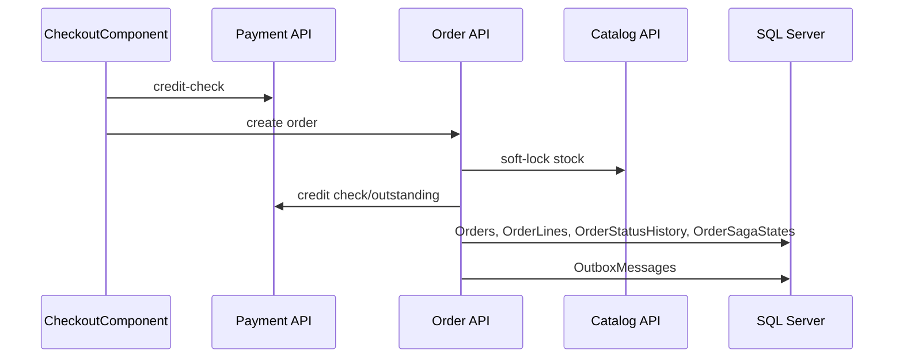

# Procesy End-To-End

## Lista procesów

| Proces | Wejście UI/API | Moduły | Dane | Status |
|---|---|---|---|---|
| Logowanie | `/login`, `POST /identity/api/auth/login` | Angular, Gateway, IdentityAuth | `Users`, `RefreshTokens`, JWT | potwierdzone |
| Rejestracja dealera | `/register`, `POST /identity/api/auth/register` | Angular, IdentityAuth, Notification/Payment przez integracje | `Users`, `DealerProfiles`, outbox | potwierdzone |
| Akceptacja dealera | `/admin/dealers/:id` | Angular, IdentityAuth, PaymentInvoice | `Users.Status`, limit kredytowy | potwierdzone |
| Katalog produktów | `/products`, `/products/:id` | Angular, CatalogInventory | `Products`, `Categories`, reviews, stock | potwierdzone |
| Checkout | `/checkout` | Angular, Order, CatalogInventory, PaymentInvoice | `Orders`, `OrderLines`, stock, credit account | potwierdzone |
| Obsługa zamówienia | `/orders`, `/orders/:id` | Order, CatalogInventory, PaymentInvoice, Notification | statusy, hold, returns, outbox | potwierdzone |
| Tracking dostawy | `/orders/:id/tracking`, `/shipments/:id` | LogisticsTracking, Order | `Shipments`, `ShipmentEvents`, `ShipmentOpsStates` | potwierdzone |
| Faktury i workflow | `/invoices`, `/invoices/:id` | PaymentInvoice | `Invoices`, `InvoiceLines`, `InvoiceWorkflowStates`, `InvoiceWorkflowActivities` | potwierdzone |
| Powiadomienia | `/notifications` | Notification, IdentityAuth | `Notifications`, kontakt użytkownika | potwierdzone |

## Checkout - pierwszy ślad

Status diagramu: `wniosek z analizy` na podstawie serwisów API frontendu, `OrdersController`, `OrderService` oraz endpointów inventory/payment.

