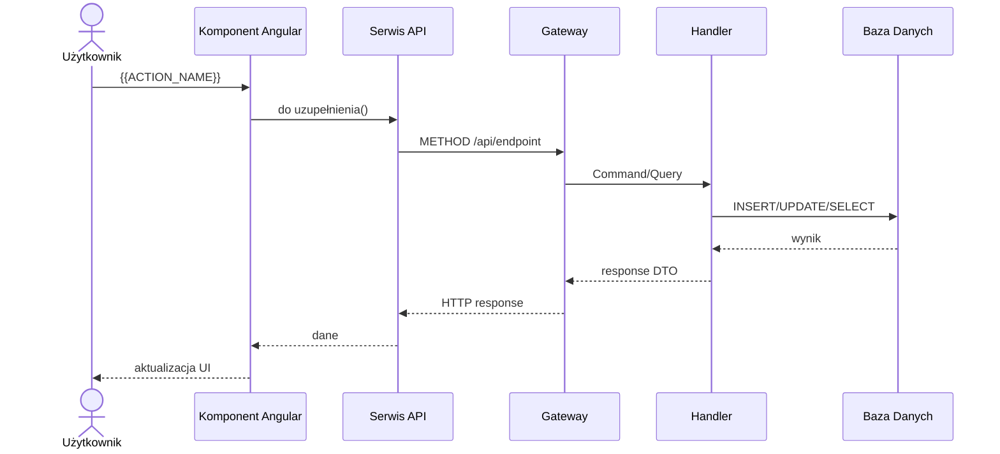

# {{ACTION_ID}} {{ACTION_NAME}}

Status: `szkielet`; wymagane ręczne uzupełnienie po analizie UI, API i procesu.

## Identyfikacja

| Atrybut | Wartość |
|---|---|
| ID akcji | `{{ACTION_ID}}` |
| Ekran | [{{SCREEN_ID}}](../E-{{SCREEN_NUMBER}}__README.md) |
| Nazwa wykryta | `{{ACTION_NAME}}` |
| Typ detekcji | `{{ACTION_KIND}}` |
| Źródło | `{{ACTION_SOURCE}}` |
| Status faktu | `do uzupełnienia` |

## Opis Akcji

**Co robi:** do uzupełnienia.  
**Wyzwalacz:** klik przycisku / submit formularza / nawigacja / inne  
**Warunki dostępności:** zawsze aktywna / [warunek — np. `order.status === 'Pending'`]  
**Skutki uboczne:** do uzupełnienia (np. odświeżenie listy, email powitalny, zdarzenie domenowe)

## Diagram Przepływu



## Ślad Techniczny

| Warstwa | Artefakt | Status |
|---|---|---|
| Element UI | do uzupełnienia | `do uzupełnienia` |
| Metoda komponentu | do uzupełnienia | `do uzupełnienia` |
| Serwis frontend | do uzupełnienia | `do uzupełnienia` |
| Endpoint API | do uzupełnienia | `do uzupełnienia` |
| Komenda/zapytanie | do uzupełnienia | `do uzupełnienia` |
| Walidacje | do uzupełnienia | `do uzupełnienia` |
| Skutek w bazie | do uzupełnienia | `do uzupełnienia` |

## Przykład Żądania HTTP

```http
METHOD /api/endpoint
Authorization: Bearer {token}
Content-Type: application/json

{
  "pole": "wartość"
}
```

## Przykład Odpowiedzi HTTP

```json
{
  "id": "guid",
  "pole": "wartość"
}
```

## Testy

- [Macierz testów ekranu](../TC-{{SCREEN_NUMBER}}_TESTY/TC-{{SCREEN_NUMBER}}__INDEX.md)
- Dane wejściowe: do uzupełnienia.
- Oczekiwany rezultat: do uzupełnienia.

## Linki

- [Indeks akcji](A-{{SCREEN_NUMBER}}__INDEX.md)
- [Pola ekranu](../P-{{SCREEN_NUMBER}}_POLA/P-{{SCREEN_NUMBER}}__INDEX.md)
- [Ślad ekranu](../E-{{SCREEN_NUMBER}}__LINKI.md)
