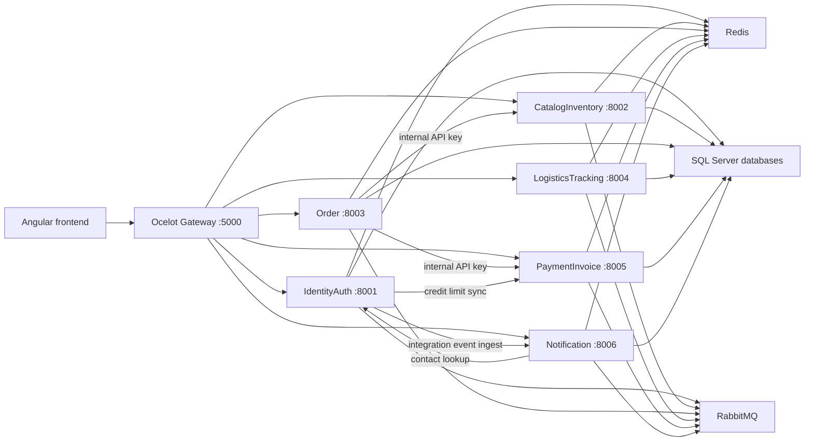

# AI Architecture HLD

## Widok systemowy

Aplikacja to lokalny POC platformy B2B supply chain. Frontend Angular komunikuje się z Ocelot Gateway, a gateway routuje ruch do szesciu mikroserwisow .NET:

- IdentityAuth: konta, role, JWT, refresh tokeny, dealerzy i agenci.
- CatalogInventory: katalog produktów, kategorie, stany magazynowe, soft-lock i hard-deduct stocku.
- Order: zamówienia, statusy, returny, saga zamówienia, integracje z kredytem i magazynem.
- LogisticsTracking: przesylki, agenci, pojazdy, statusy dostaw, ops-state i chatbot logistyczny.
- PaymentInvoice: limity kredytowe dealerow, outstanding, płatności Razorpay, faktury i workflow faktur.
- Notification: notyfikacje manualne i z eventów integracyjnych, kanał InApp/Email, wysylka e-mail.

## Warstwy backendu

- `*.API`: kontrolery, auth, middleware błędów, Swagger, health, start migracji, Hangfire.
- `*.Application`: DTO, komendy/zapytania MediatR, walidatory, kontrakty, serwisy aplikacyjne.
- `*.Domain`: encje, enumy i reguły domenowe.
- `*.Infrastructure`: EF Core DbContext, repozytoria, migracje, integracje HTTP, cache Redis, outbox, gatewaye techniczne.
- `src/BuildingBlocks`: zachowania MediatR, kontrakty idempotency/cache/outbox, Redis helpers, OutboxMessage.
- `src/SharedKernel`: bazowe abstrakcje `Entity`, `ValueObject`, `IntegrationEvent`.

## Przeplywy kluczowe

- Logowanie: Angular `AuthApiService.login` -> `/identity/api/auth/login` -> `AuthController` -> `LoginCommand` -> `IdentityAuthService` -> `JwtTokenService` i refresh cookie.
- Katalog: Angular `CatalogApiService` -> `/catalog/api/products` -> `ProductsController` -> `CatalogInventoryService` -> `CatalogInventoryRepository` -> `CatalogInventoryDbContext`.
- Zamówienie: Angular `OrderApiService.createOrder` -> `/orders/api/orders` -> `OrdersController` -> `CreateOrderCommand` -> `OrderService`.
- Twórzenie zamówienia wykonuje soft-lock stocku w CatalogInventory, credit-check w PaymentInvoice, zapis OrderDb, outbox event i start `OrderSagaCoordinator`.
- Status `ReadyForDispatch -> InTransit` uruchamia hard-deduct zarezerwowanego stocku.
- Anulowanie przed wysylka probuje release soft-locku.
- Return approved restockuje produkty i zmniejsza outstanding dealera w PaymentInvoice.
- Faktury: `PaymentApiService` -> `PaymentController` -> `PaymentInvoiceService`; PDF generuje `QuestPdfInvoiceGenerator`.
- Notyfikacje: serwisy publikuja outbox do RabbitMQ, Notification może konsumowac eventy i/lub przyjmowac `/api/notifications/ingest`.

## Cross-cutting concerns

- Correlation ID: frontend i gateway używaja `X-Correlation-Id`; middleware błędów zwraca go w payloadzie.
- Auth: gateway i serwisy waliduja JWT; role są egzekwowane w kontrolerach.
- Internal API: endpointy `/api/internal/*` wymagaja `X-Internal-Api-Key`.
- Bledy: serwisy mapuja `ValidationException`, `UnauthorizedAccessException`, `KeyNotFoundException`, `HttpRequestException`, `TaskCanceledException`, `InvalidOperationException` do JSON `{ code, messąge, retryable, correlationId, details }`.
- Gateway ma rate limiting globalny i Ocelot route rate limits; frontend dodaje `Oc-Client`.
