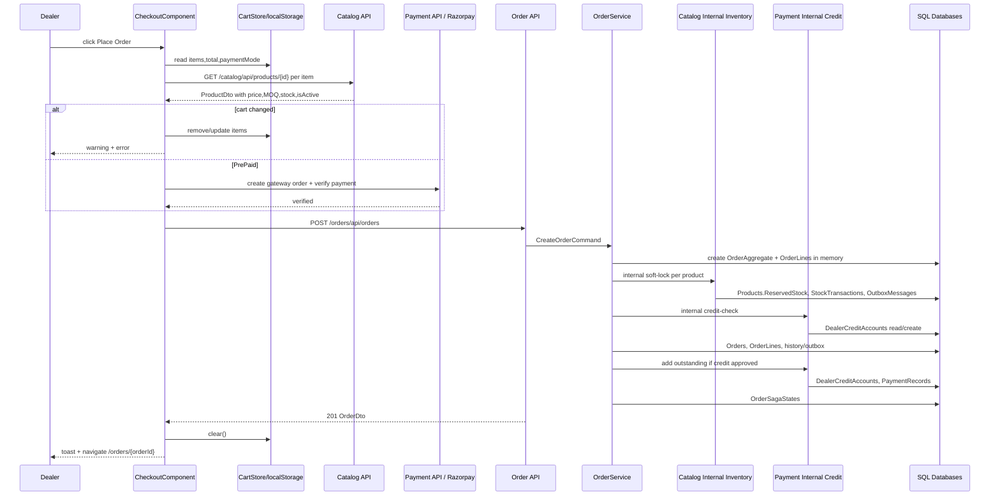

# AOS Checkout Create Order - Actions And Process Trace

## Cel Pliku

Ten plik mapuje akcje użytkownika na przepływ systemowy od ekranu checkout do zapisu zamówienia i danych zależnych.

## Macierz Akcji

| ID akcji | Nazwa UI | Trigger | Metoda front | API | Proces backend | Skutek danych | Testy |
|---|---|---|---|---|---|---|---|
| `AOS-ORD-CHECKOUT-ACT-002` | Zmiana metody płatności | radio change | `onPaymentChange()` | `GET /payments/api/payment/dealers/{dealerId}/credit-check` dla `PrePaid` | `PaymentInvoiceService.CheckCreditAsync` | Czyta/tworzy `DealerCreditAccounts` | `AOS-ORD-CHECKOUT-API-TC-003` |
| `AOS-ORD-CHECKOUT-ACT-003` | Place Order | button click | `placeOrder()` -> `submitOrder()` | `GET /catalog/api/products/{id}`, opcjonalnie payment gateway, `POST /orders/api/orders` | `OrderService.CreateOrderAsync` | `Orders`, `OrderLines`, `OrderStatusHistory`, `OutboxMessages`, `OrderSagaStates`, `Products.ReservedStock`, `StockTransactions`, `DealerCreditAccounts`, `PaymentRecords` | `AOS-ORD-CHECKOUT-TC-001..007` |

## `AOS-ORD-CHECKOUT-ACT-003` - Place Order

### Cel Biznesowy

Dealer potwierdza koszyk i tworzy zamówienie. System ma zabezpieczyć proces przed nieaktualnym stockiem/ceną po stronie UI oraz przed brakiem rezerwacji stocku i brakiem kredytu po stronie backendu.

### Warunki Dostępnosci W UI

| Warunek | Źródło | Co jesli niespelniony |
|---|---|---|
| Użytkownik zalogowany | `authGuard` | Brak dostępu do shell routes |
| Rola `Dealer` | `roleGuard`, `app.routes.ts` | Redirect/unauthorized wedlug guard |
| Koszyk niepusty | `ngOnInit()` i `placeOrder()` | Przekierowanie do `/cart` albo no-op |
| `loading() == false` | `[disabled]="loading()"` | Button disabled |

### Przeplyw Techniczny



### Kroki Procesu

| Krok | Warstwa | Co się dzieje | Źródło w kodzie | Dane wejścia | Dane wyjścia |
|---|---|---|---|---|---|
| 1 | UI | Jeśli koszyk pusty, stop/przekierowanie | `checkout.component.ts` | `cartStore.items()` | `/cart` albo kontynuacja |
| 2 | UI | Walidacja koszyka przez aktualne dane produktu | `validateCartAgainstCurrentStock()` | `CartItem[]` | `valid=true/false`, ewentualna aktualizacja koszyka |
| 3 | UI/API | Dla każdej pozycji pobranie produktu | `CatalogApiService.getProductById()` | `productId` | `ProductDto` |
| 4 | UI | Dla `PrePaid` załadowanie Razorpay, utworzenie gateway order i weryfikacja płatności | `startGatewayPaymentFlow()`, `verifyGatewayPayment()` | `total`, dane Razorpay | `verified=true/false` |
| 5 | UI/API | Zbudowanie `CreateOrderRequest` i POST | `submitOrder()`, `OrderApiService.createOrder()` | `paymentMode`, `idempotencyKey`, `lines` | `OrderDto` albo błąd |
| 6 | API | Pobranie `DealerId` z tokenu i wysłanie komendy | `OrdersController.Create()` | JWT sub/nameidentifier, request body | `CreateOrderCommand` |
| 7 | Application | Walidacja requestu | `CreateOrderRequestValidator` | `CreateOrderRequest` | OK albo FluentValidation exception |
| 8 | Domain | Utworzenie agregatu i linii | `OrderAggregate.Create()`, `OrderAggregate.AddLine()` | DealerId, orderNumber, paymentMode, lines | `OrderAggregate` z `TotalAmount` |
| 9 | Integration | Soft-lock stocku dla każdej pozycji | `SoftLockOrderStockAsync()`, `CatalogInventoryGateway.SoftLockStockAsync()` | `orderId`, `productId`, `quantity` | true/false |
| 10 | Catalog service | Rezerwacja stocku | `CatalogInventoryService.SoftLockStockAsync()` | `SoftLockStockRequest` | `Products.ReservedStock`, `StockTransactions`, outbox |
| 11 | Integration | Credit-check | `PaymentCreditCheckGateway.CheckCreditAsync()` | `dealerId`, `totalAmount` | `CreditCheckResult` |
| 12 | Domain | Credit approved: `Processing`; credit failed: `OnHold` | `MarkCreditApproved()`, `TransitionTo()`, `MarkCreditHold()` | `CreditCheckResult` | status, creditHoldStatus, history dla approved |
| 13 | Persistence | Zapis zamówienia i outboxa | `OrderRepository.AddOrderAsync()`, `SaveChangesAsync()` | `OrderAggregate` | SQL rows |
| 14 | Integration | Jeśli credit approved: dodanie outstanding | `PaymentCreditCheckGateway.AddOutstandingAsync()` | dealer/order/amount/paymentMode | `DealerCreditAccounts`, `PaymentRecords` |
| 15 | Saga | Start i finalizacja sagi | `OrderSagaCoordinator` | orderId, orderNumber, dealerId | `OrderSagaStates` |
| 16 | UI | Sukces | `submitOrder().next` | `OrderDto` | clear cart, clear draft, toast, navigate |

### Reguły Biznesowe W Procesię

| ID reguły | Opis | Gdzie egzekwowana | Blad gdy naruszona |
|---|---|---|---|
| `AOS-ORD-CHECKOUT-RULE-001` | Checkout jest tylko dla `Dealer`. | `app.routes.ts`, `OrdersController.Create [Authorize(Roles="Dealer")]` | frontend redirect/403; backend 403 |
| `AOS-ORD-CHECKOUT-RULE-002` | Koszyk nie może być pusty. | `ngOnInit()`, `placeOrder()`, `CreateOrderRequestValidator.Lines.NotEmpty()` | redirect/no-op albo 400 validation |
| `AOS-ORD-CHECKOUT-RULE-003` | Produkt musi być aktywny i mieć stock. | frontend `validateCartAgainstCurrentStock()`, backend Catalog soft-lock | UI aktualizuje koszyk; backend zwraca failure soft-lock |
| `AOS-ORD-CHECKOUT-RULE-004` | Ilość musi być dodatnia i nie mniejsza niż MOQ. | `CartStore.normalizeQuantity()`, `CreateOrderRequestValidator`, `OrderLine.Create()` | UI normalizuje; backend validation/exception |
| `AOS-ORD-CHECKOUT-RULE-005` | Credit-check decyduje czy zamówienie idzie do `Processing` czy `OnHold`. | `OrderService.CreateOrderAsync()` | OnHold + outbox `AdminApprovalRequired` |

### Efekty Uboczne

| Typ | Opis | Źródło |
|---|---|---|
| Local storage | Odczyt koszyka `sc_cart`, zapis draftu `sc_checkout_draft`, clear po sukcesie | `CartStore`, `CheckoutComponent` |
| Event/outbox Order | `OrderPlaced` albo `AdminApprovalRequired` | `OrderService.CreateOrderAsync()` |
| Event/outbox Catalog | `StockSoftLocked` | `CatalogInventoryService.SoftLockStockAsync()` |
| Event/outbox Payment | `PaymentCaptured` / `PaymentFailed` dla Razorpay verify | `PaymentInvoiceService.VerifyGatewayPaymentAsync()` |
| Integracja HTTP | Order -> Catalog internal inventory | `CatalogInventoryGateway` |
| Integracja HTTP | Order -> Payment internal credit/outstanding | `PaymentCreditCheckGateway` |
| Cache | Soft-lock key `inventory:softlock:{productId}:{orderId}` i invalidacja cache product list/detail/search | `CatalogInventoryService` |
| UI refresh | Przekierowanie na `/orders/{orderId}` | `CheckoutComponent.submitOrder()` |

### Scenariusze Błędu

| Sytuacja | Warstwa | Status / komunikat | Zachowanie UI | Test |
|---|---|---|---|---|
| Brak tokenu / invalid token | Order API | 401 `{ messąge: "Invalid token." }` | Pokazuje `Invalid token.` albo fallback | `AOS-ORD-CHECKOUT-API-TC-004` |
| Rola inna niż Dealer | Front/backend | 403 | Brak dostępu / error | `AOS-ORD-CHECKOUT-E2E-002` |
| Product not found/ inactive / no stock | UI/Catalog | frontend messąge | Koszyk usunięty/zmieniony, order nie wysłany | `AOS-ORD-CHECKOUT-TC-003` |
| Soft-lock nieudany | Backend Order/Catalog | Exception `Unable to reserve stock...` | Alert z backend messąge albo fallback | `AOS-ORD-CHECKOUT-API-TC-005` |
| Credit-check niedostępny | Backend Order/Payment | fallback `CreditCheckResult(false,0,0,0)` | Order zapisany jako `OnHold` | `AOS-ORD-CHECKOUT-API-TC-006` |
| Payment gateway niedostępny | UI/Payment | `Failed to load/init/verify...` | Order nie jest wysłany | `AOS-ORD-CHECKOUT-E2E-003` |

## Algorytm

```text
1. Dealer klika Place Order.
2. Jeżeli koszyk pusty, zakoncz.
3. Dla każdego itemu pobierz ProductDto z Catalog.
4. Jeżeli produkt nie istnieje, jest nieaktywny albo stock <= 0, usun item.
5. Przelicz quantity wg minOrderQty i availableStock.
6. Jeżeli cena, SKU, nazwa, MOQ albo stock zmieniły się, zaktualizuj item i przerwij proces.
7. Jeżeli paymentMode = PrePaid, wykonaj Razorpay create order i verify.
8. Zbuduj CreateOrderRequest i wyślij POST /orders/api/orders.
9. Backend waliduje request.
10. Backend tworzy OrderAggregate i OrderLines.
11. Backend soft-lockuje stock w Catalog dla każdego productId.
12. Backend sprawdza credit w Payment.
13. Jeżeli credit approved, przejdź Placed -> Processing i dodaj outbox OrderPlaced.
14. Jeżeli credit rejected/unavailable, ustaw OnHold i dodaj outbox AdminApprovalRequired.
15. Backend zapisuje Orders, OrderLines, history/outbox.
16. Jeżeli credit approved, Payment dostaje outstanding dla orderId.
17. Backend tworzy/aktualizuje OrderSagaStates.
18. Front czyści koszyk i draft, pokazuje toast, przechodzi do /orders/{orderId}.
```
