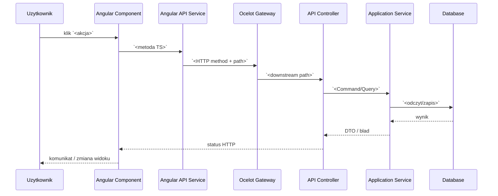

# AOS Actions And Process Trace Template

## Cel Pliku

Ten plik mapuje akcje uzytkownika na rzeczywisty proces systemowy. Dla kazdego przycisku albo operacji trzeba pokazac: co uruchamia frontend, jakie API jest wolane, jaka logika biznesowa dziala, jakie walidacje moga zatrzymac proces i jaki jest finalny skutek w danych.

## Macierz Akcji

| ID akcji | Nazwa UI | Trigger | Metoda front | API | Proces backend | Skutek danych | Testy |
|---|---|---|---|---|---|---|---|
| `AOS-<MOD>-<SCREEN>-ACT-001` | `<np. Approve>` | `<klik>` | `<component.method>` | `<endpoint>` | `<command/service>` | `<tabela SQL / kolumny SQL / event>` | `<TC IDs>` |

## Szablon Opisu Akcji

### `AOS-<MOD>-<SCREEN>-ACT-001` - `<Nazwa akcji>`

#### Cel Biznesowy

`<Co ta akcja ma osiagnac z perspektywy procesu biznesowego.>`

#### Warunki Dostepnosci W UI

| Warunek | Zrodlo | Co jesli niespelniony |
|---|---|---|
| `<rola/status/flaga>` | `<component/store>` | `<ukryty/disabled/error>` |

#### Przeplyw Techniczny



#### Kroki Procesu

| Krok | Warstwa | Co sie dzieje | Zrodlo w kodzie | Dane wejscia | Dane wyjscia |
|---|---|---|---|---|---|
| 1 | UI | `<walidacja formularza / potwierdzenie>` | `<plik>` | `<dane>` | `<dane>` |
| 2 | API | `<request>` | `<api service>` | `<DTO>` | `<response>` |
| 3 | Backend | `<komenda / serwis>` | `<handler/service>` | `<DTO>` | `<entity/result>` |
| 4 | Persistence | `<zapis/odczyt>` | `<repo/DbContext>` | `<entity>` | `<tabela SQL / kolumny SQL>` |

#### Reguly Biznesowe W Procesie

| ID reguly | Opis | Gdzie egzekwowana | Blad gdy naruszona |
|---|---|---|---|
| `AOS-<MOD>-<SCREEN>-RULE-001` | `<regula>` | `<validator/domain/service>` | `<kod/komunikat>` |

#### Efekty Uboczne

| Typ | Opis | Zrodlo |
|---|---|---|
| Event/outbox | `<event>` | `<AddOutboxMessage / dispatcher>` |
| Integracja HTTP | `<serwis docelowy>` | `<IntegrationGateway>` |
| Cache | `<invalidate/read/write>` | `<cache service>` |
| Background job | `<Hangfire/consumer>` | `<job/hosted service>` |
| UI refresh | `<reload listy / update store>` | `<component/store>` |

#### Scenariusze Bledu

| Sytuacja | Warstwa | Status / komunikat | Zachowanie UI | Test |
|---|---|---|---|---|
| `<np. brak uprawnien>` | `<backend>` | `<403>` | `<toast/redirect>` | `<TC>` |

## Algorytmy I Decyzje

Jesli akcja uruchamia algorytm, opisz go pseudokodem:

```text
1. Pobierz rekord X.
2. Sprawdz warunek A.
3. Jezeli A nie przechodzi, zwroc blad B.
4. Dla kazdej pozycji wykonaj C.
5. Zapisz wynik w tabeli SQL D i wskazanych kolumnach.
6. Opublikuj event E.
```

Do pseudokodu dodaj zrodlo: metoda, plik, encja domenowa, serwis aplikacyjny.
